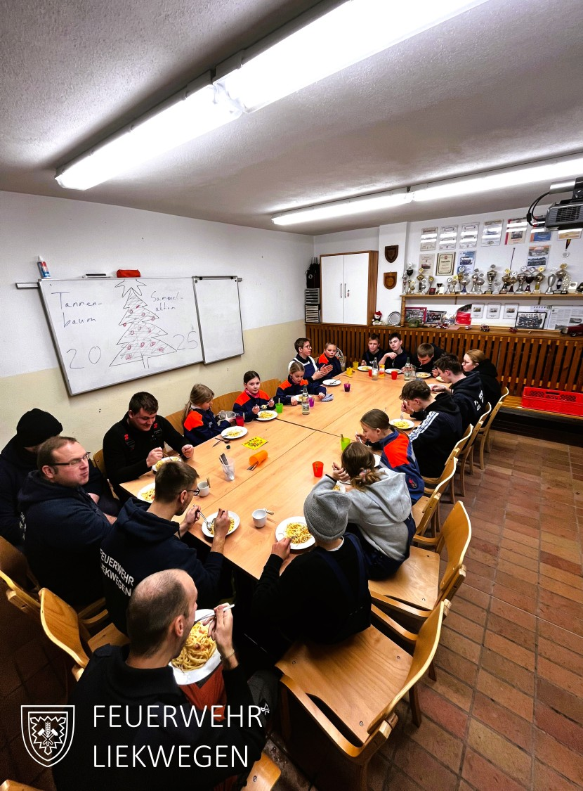

Mit der - fast schon traditionellen - Tannenbaumsammelaktion ist unserer Jugendfeuerwehr am letzten Samstag erfolgreich in das neue Jahr gestartet!

Mit insgesamt drei Fahrzeugen, drei Anhängern, 12 Kindern und Jugendlichen und mehreren Betreuern und Helfern aus der Einsatzabteilung wurden Straße für Straße alle Tannenbäume im Dorf eingesammelt. Dabei bekam die Jugendfeuerwehr viel Zuspruch aus dem Dorf und es kamen etliche Spenden, Süßigkeiten und viele nette Worte für unsere Arbeit zusammen.

Die Kinder und Jugendlichen waren dabei über 6 Stunden im Einsatz. Und so wurde in dieser Zeit auch selber gekocht und gemeinsam im JF Gerätehaus gegessen.

An alle Spenderinnen und Spender noch ein herzliches Dankeschön!

Außerdem einen großen Dank an die FF Hespe, die uns für diesen Tag Ihren MTW zur Verfügung gestellt hat!


    
    
    
    
