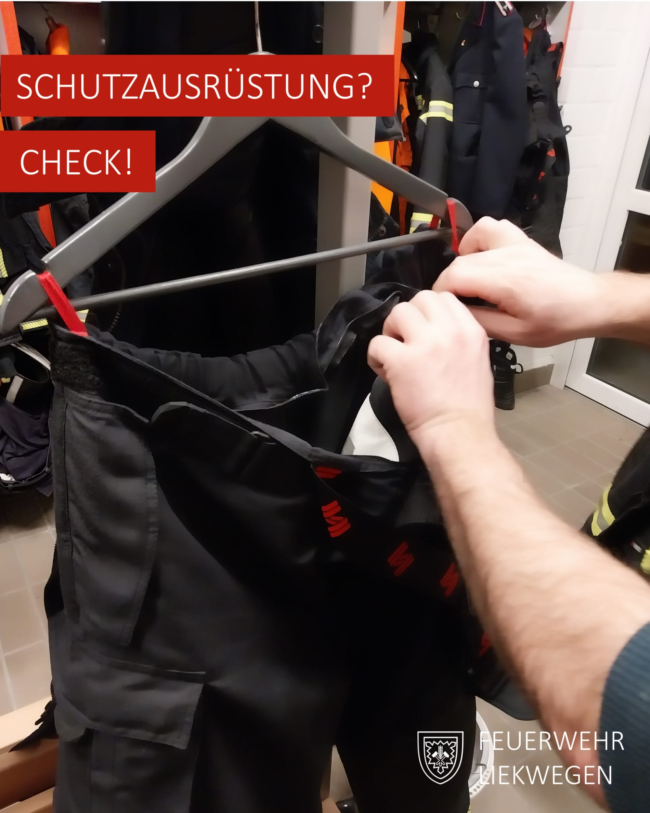
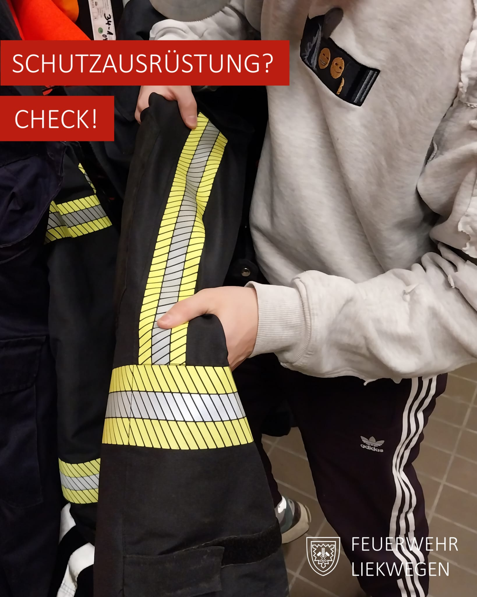


Sicherheit an erster Stelle: Jährliche Prüfung der Persönlichen Schutzausrüstung (PSA)


Auch während der dunklen Jahreszeit gibt es bei uns genug zu tun. Beim letzten Feuerwehrdienst stand die jährliche Prüfung unserer Persönlichen Schutzausrüstung (PSA) auf dem Programm. Ein wichtiger Termin, denn nur mit einwandfreier Ausrüstung können wir unsere Einsätze sicher und effektiv meistern.

Unsere Checkliste:
- **Risse im Oberstoff:** Unsere PSA muss dicht halten, denn jeder Schaden kann ein Sicherheitsrisiko sein.
- **Reflexstreifen:** Die Sichtbarkeit im Dunkeln ist entscheidend – hier darf nichts abgenutzt sein.
- **Reißverschluss:** Ein funktionsfähiger Reißverschluss ist im Einsatz unverzichtbar.
- **Innere Membran:** Sie schützt vor Hitze und muss intakt sein. Ohne sie steigt das Risiko von Verbrühungen oder Verbrennungen.
- **Allgemeine Sauberkeit:** Verschmutzte PSA kommt bei uns nicht zum Einsatz! Dank regelmäßiger Reinigung bleibt sie nicht nur sauber, sondern auch sicher – Kontaminationen haben bei uns keine Chance.
Unsere Persönliche Schutzausrüstung ist unser täglicher Begleiter und ein unverzichtbarer Teil unserer Arbeit. Hinter den Kulissen der Feuerwehr gibt es viel zu tun. Und das machen wir mit größter Sorgfalt. Denn Sicherheit beginnt schon vor dem Einsatz.


    
    


---

**Haben Sie Fragen zu unserer Arbeit oder Interesse an einem Ehrenamt bei der Feuerwehr? Sprechen Sie uns gerne an!**

info@feuerwehr-liekwegen.de \
https://www.facebook.com/feuerwehrliekwegen/ \
https://instagram.com/feuerwehr.liekwegen
