
Große Ereignisse werfen Ihre Schatten voraus!


Voraussichtlich Anfang April 2025 werden wir unser neues Löschfahrzeug (LF 10) bekommen!

Damit bis dahin im Gerätehaus alles perfekt vorbereitet ist, waren die Kameradinnen und Kameraden der Einsatzabteilung in den letzten Wochen sehr, sehr fleißig und haben viele zusätzliche Arbeitsstunden investiert.
Wer in den letzten Wochen einmal am Feuerwehrhaus in der Schulstraße 29a vorbeigegangen ist, konnte das geschäftige Treiben sicherlich manchmal beobachten.

Es wurde:
-	aufgeräumt und umgeräumt
-	geputzt und Böden gereinigt
-	Spinde in der Fahrzeughalle abgebaut und wieder im neuem Umkleidebereich aufgebaut
-	mit Hilfe eine Firma eine Trockenbauwand zwischen den Stellplätzen eingezogen und verfliest
-	die gesamte Fahrzeughalle gestrichen
-	Tafel, Uhren, Bewegungsmelder und weiteres Equipment installiert

Ergebnis ist jetzt ein komplett neuer Umkleidebereich und ein frisch renovierter Stellplatz für das LF10! Damit haben wir eine wichtige Hürde genommen und sind in großer Vorfreude auf das neue Fahrzeug.


    
    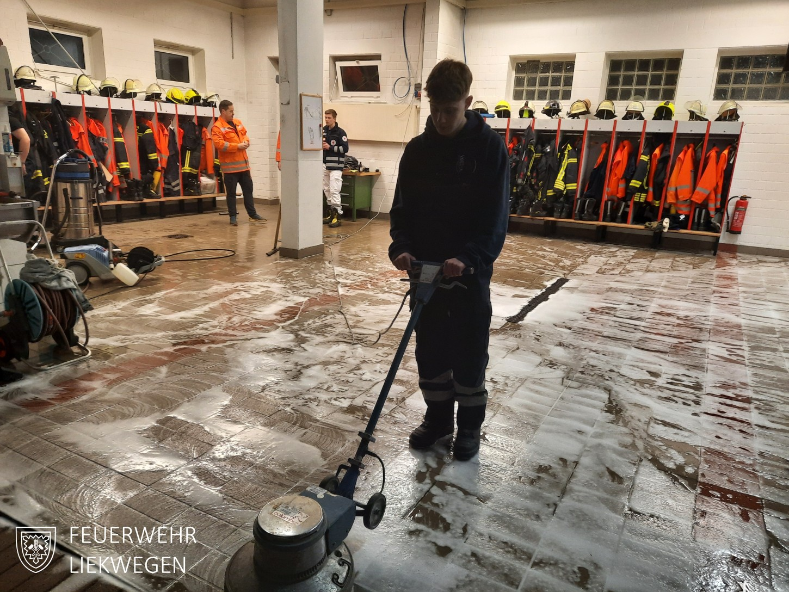
    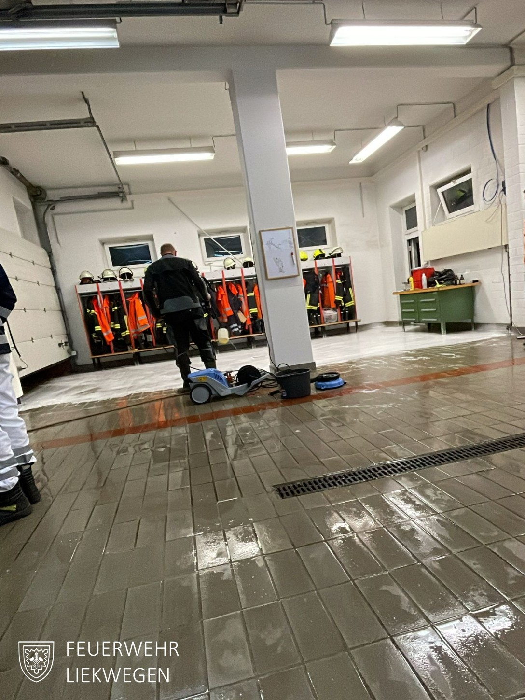
    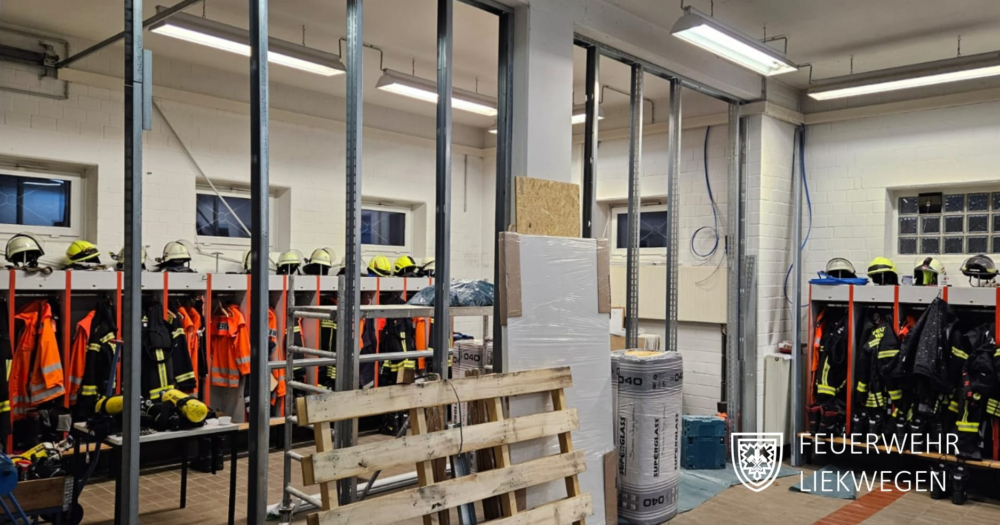
    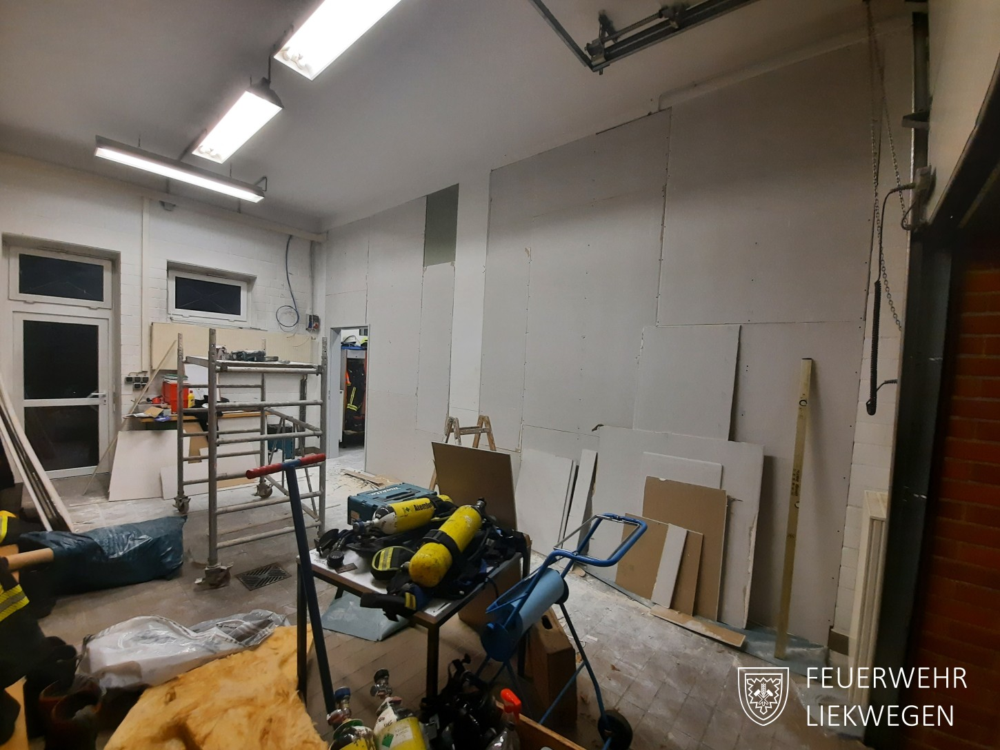
    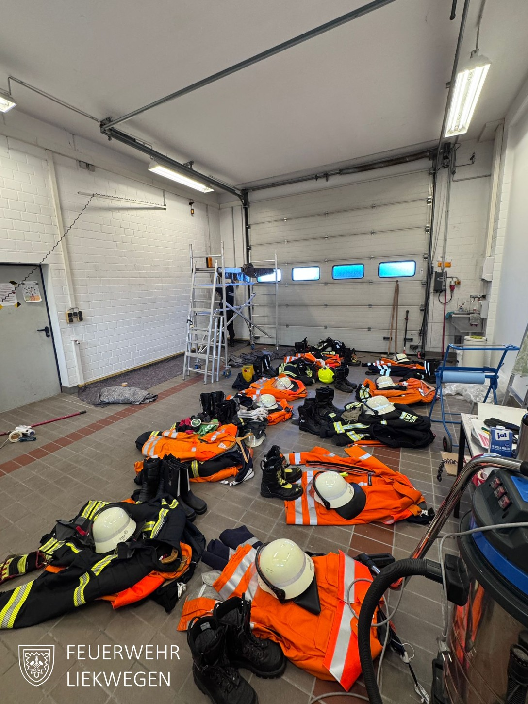
    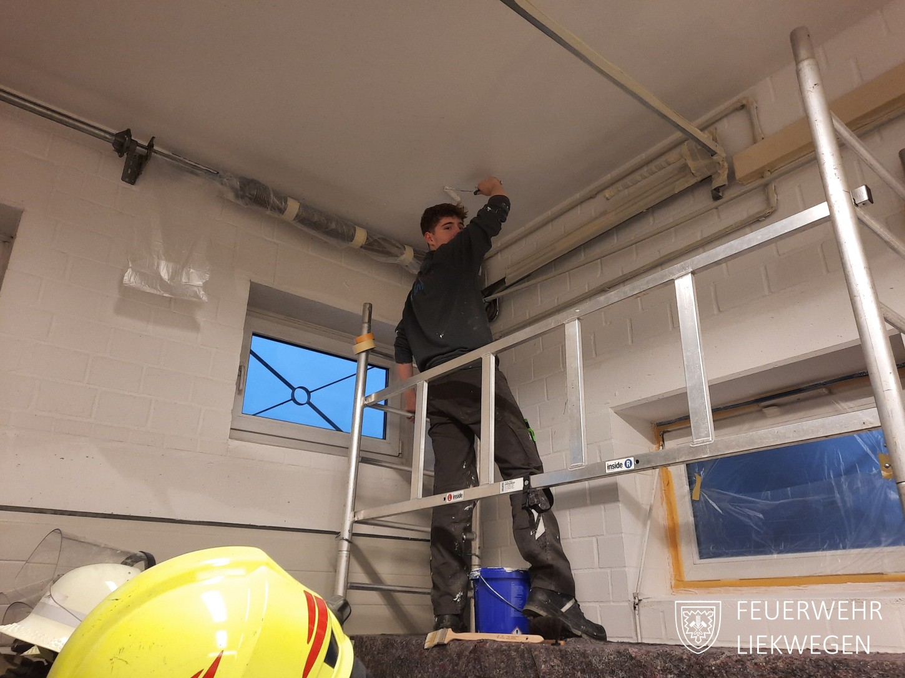
    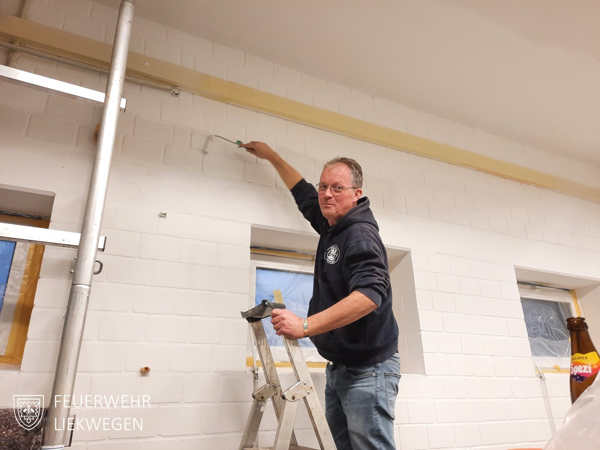
    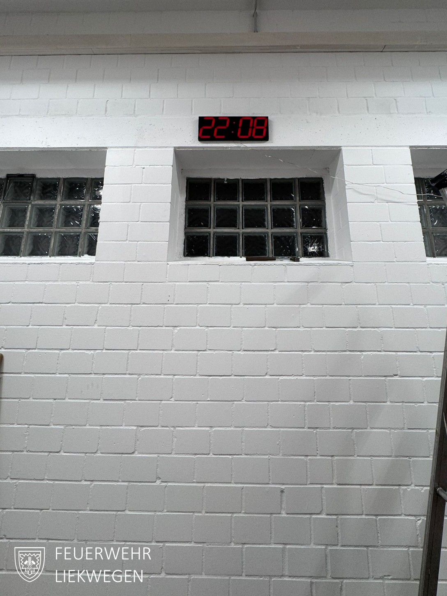
    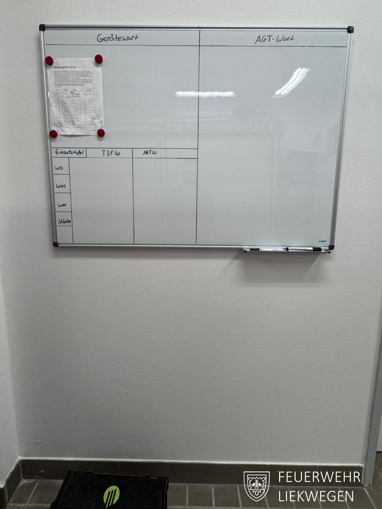
    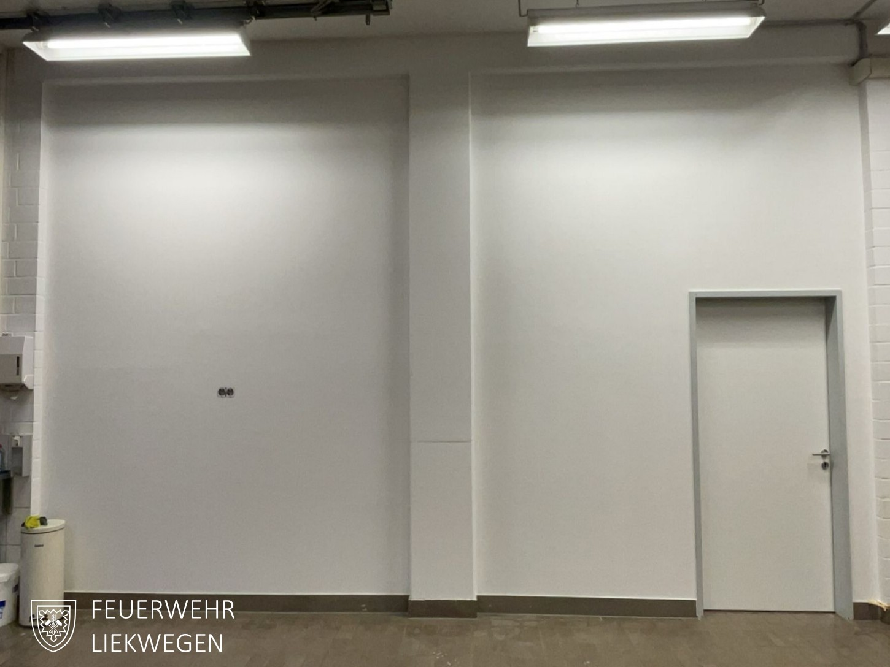
    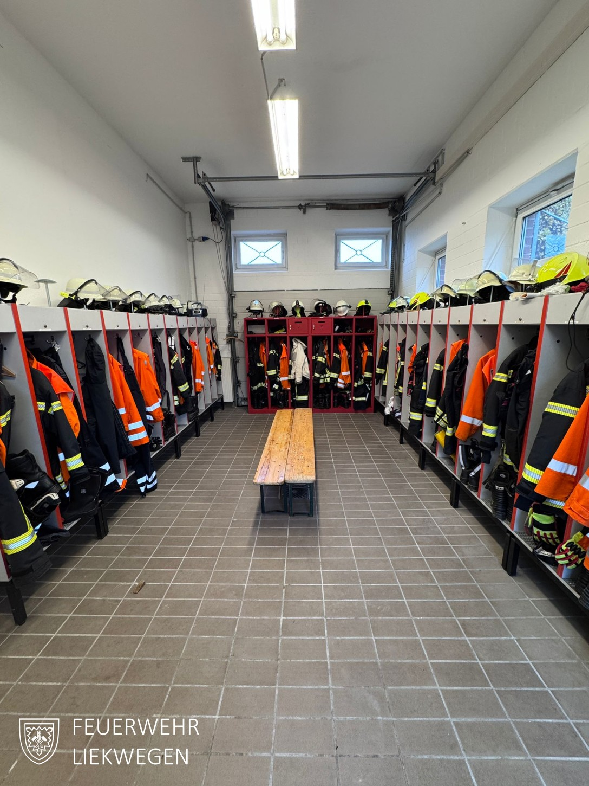
