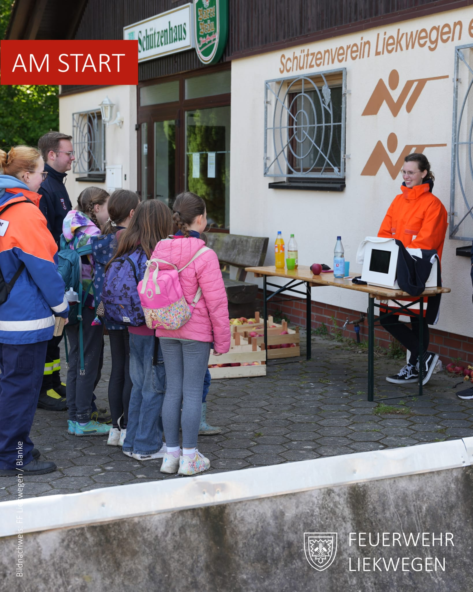
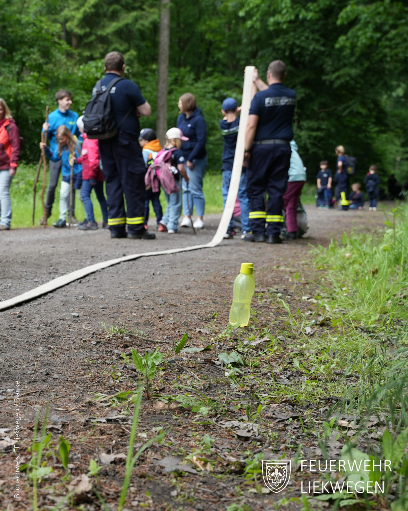
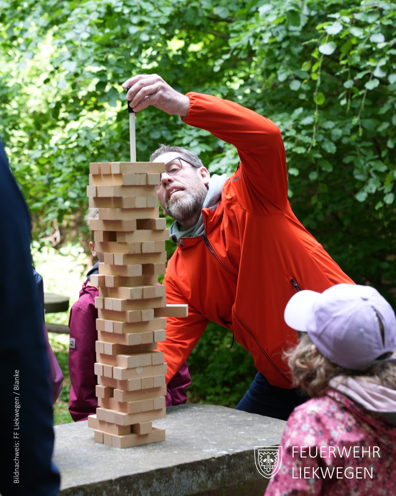
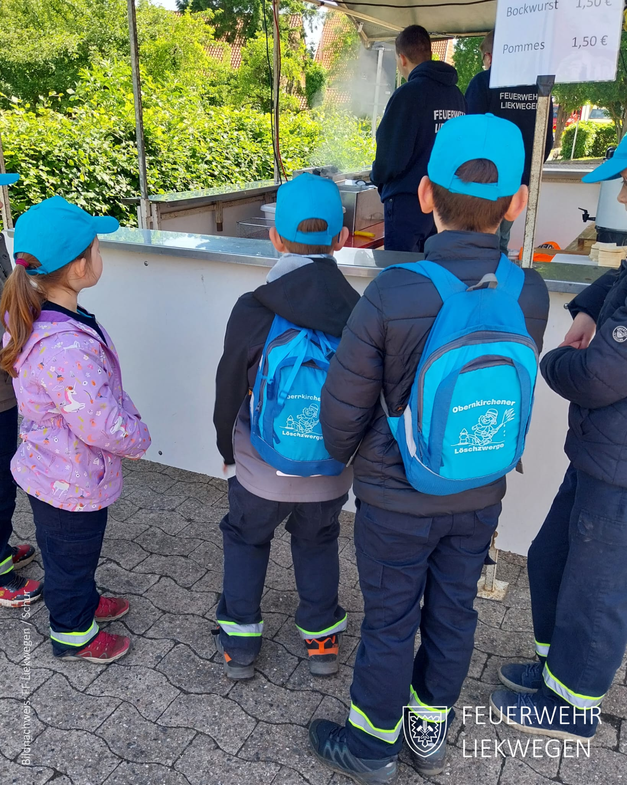
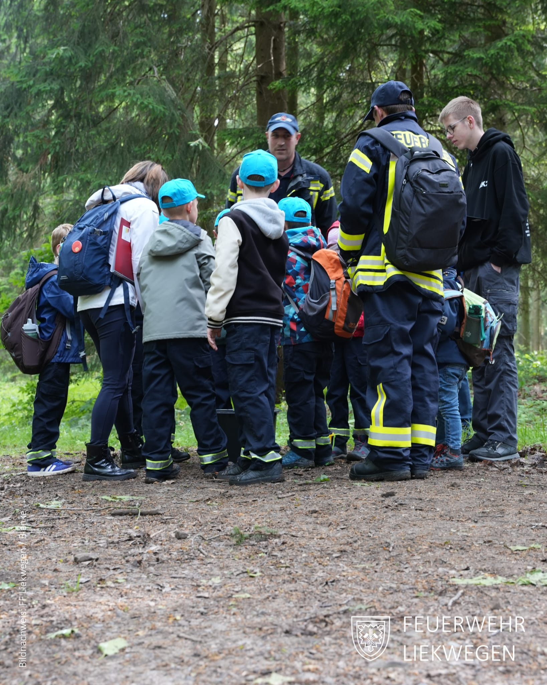
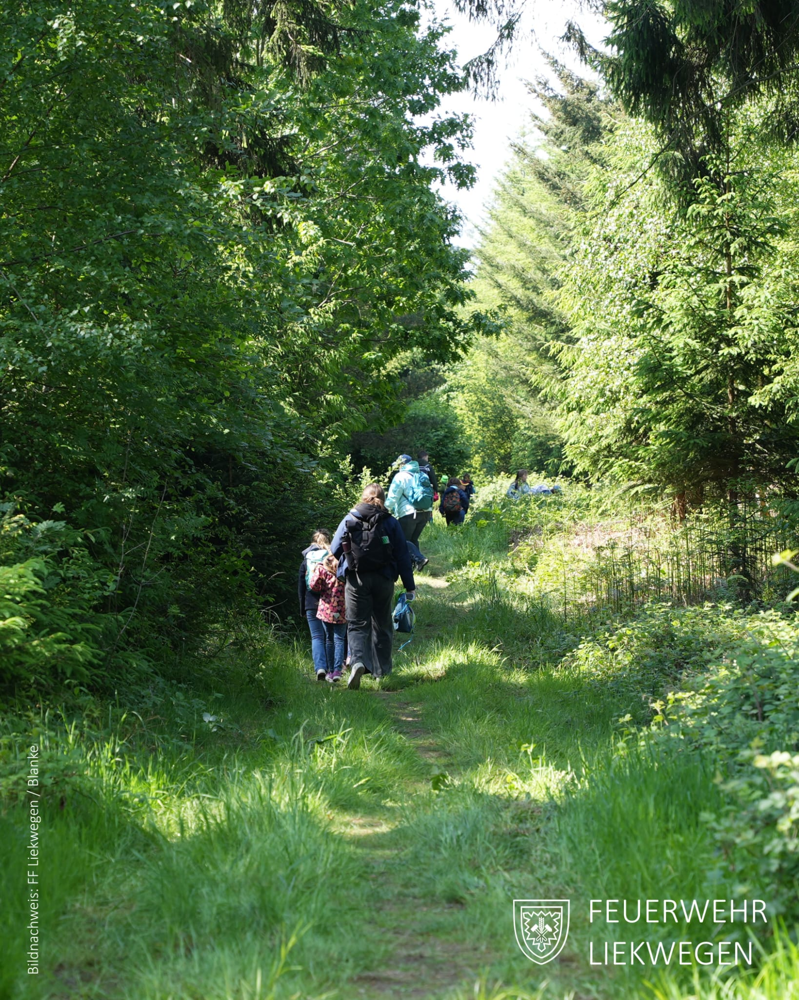
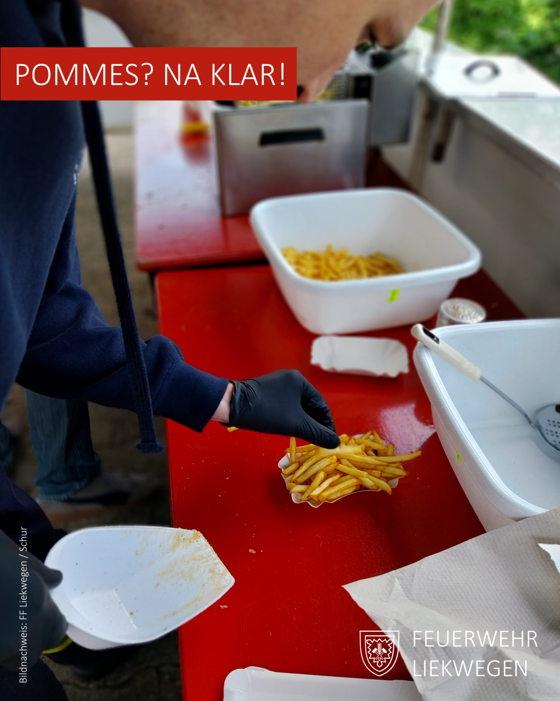
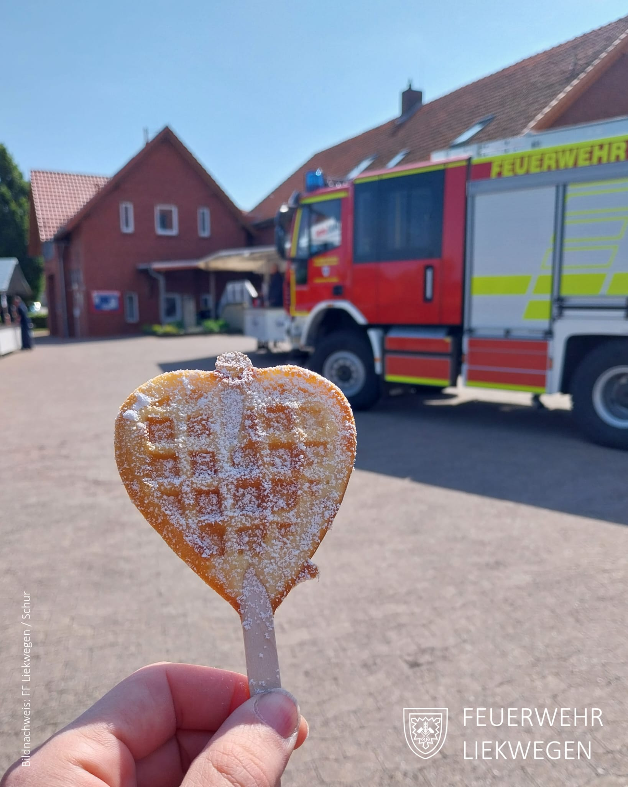
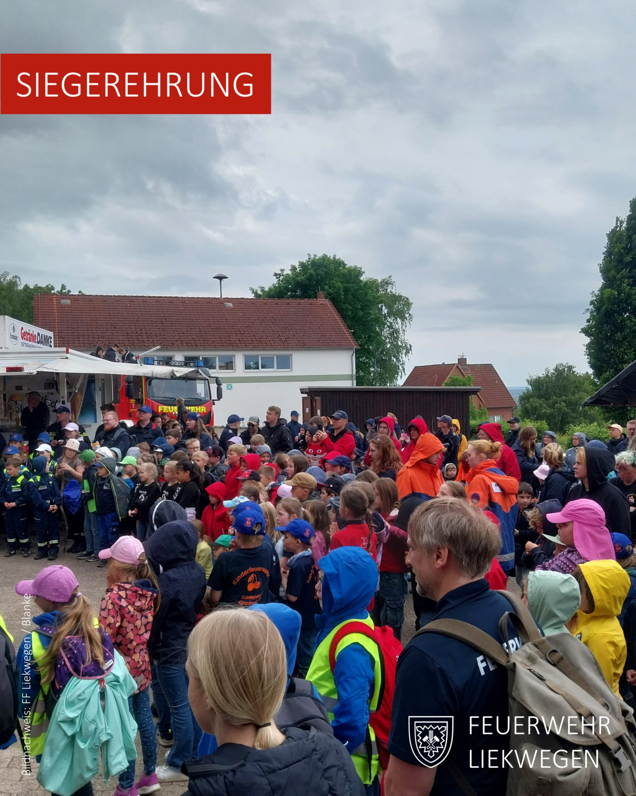
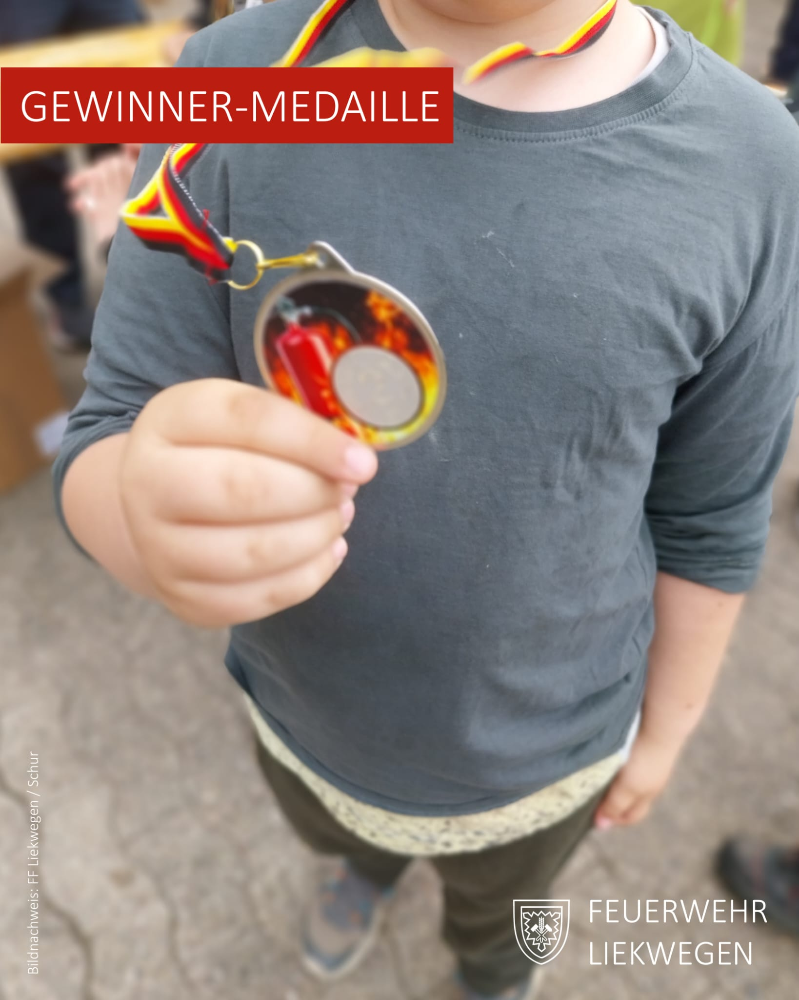


Ein Tag voller Teamgeist und Abenteuer


Am Samstag, den 24. Mai 2025 durften wir zahlreiche kleine Feuerwehrleute aus dem gesamten Landkreis zum Kreis-Kinderfeuerwehr-Orientierungsmarsch bei uns in Liekwegen begrüßen. Der Orientierungsmarsch findet jährlich statt und wird jedes Jahr an einem anderen Ort im Landkreis ausgerichtet – in diesem Jahr war Liekwegen Gastgeber.

Bei überwiegend sonnigem Wetter machten sich insgesamt 38 Kinderfeuerwehrgruppen mit etwa 300 Kindern im Alter von 6 bis 10 Jahren auf den rund vier Kilometer langen Rundkurs durch unseren schönen Liekweger Wald.

Entlang der Strecke erwarteten die Nachwuchsfeuerwehrleute abwechslungsreiche Stationen, an denen Teamgeist, Geschicklichkeit und kreative Lösungsansätze gefragt waren. Auch die erwachsenen Betreuerinnen und Betreuer durften bei einer eigenen Station ihr Können unter Beweis stellen – deren Ergebnis floss in die Gesamtwertung ein.

Der Startschuss fiel um 9:00 Uhr am Sportplatz Liekwegen, und nach einem spannenden Tag voller Herausforderungen und Spaß fand die Siegerehrung um 15:30 Uhr am Feuerwehrhaus Liekwegen statt.

**Die Plätze auf dem Siegertreppchen belegten:**\
•	Platz 1: Kinderfeuerwehr Nord („Löschriesen“)\
•	Platz 2: Krankenhagen/Volksen II („Kleine Löschmeister“)\
•	Platz 3: Hülsede/Schmarrie II („Feuerzwerge“)

Alle teilnehmenden Gruppen erhielten als Anerkennung ein kleines Präsent, die drei Erstplatzierten wurden zudem mit Medaillen ausgezeichnet.

**Ein besonderer Dank gilt auch unseren Sponsoren und Förderern:**\
Familie Blanke, Ilona Kreft, Herr Michael Geweke, Samtgemeindebürgermeister Stefan Kolb, Volksbank Schaumburg und Nienburg, Kauffeldt Transport & Logistik GmbH (Nienstädt), Molthahn Transporte GmbH (Nienstädt) sowie die Orts-CDU für die finanzielle Unterstützung.


    
    
    
    
    
    
    
    
    
    
    
