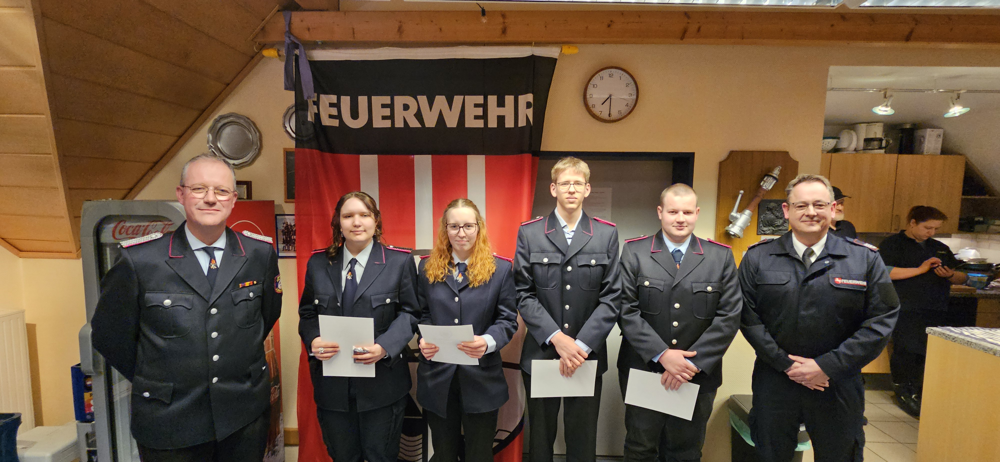
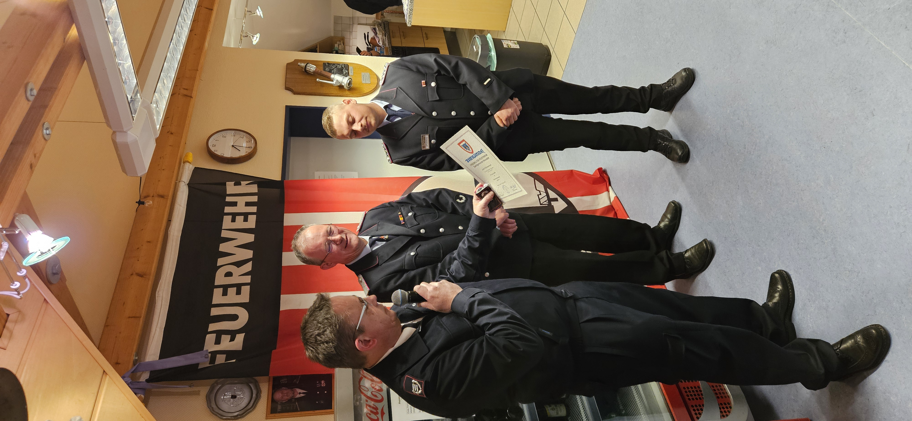
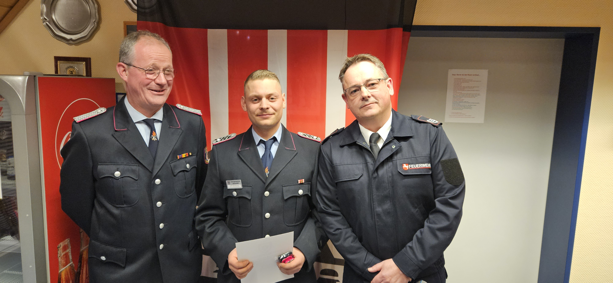
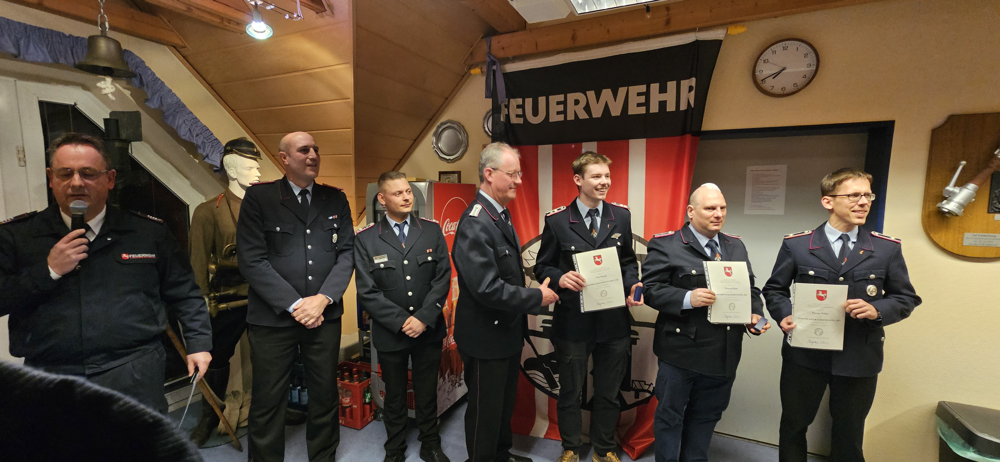
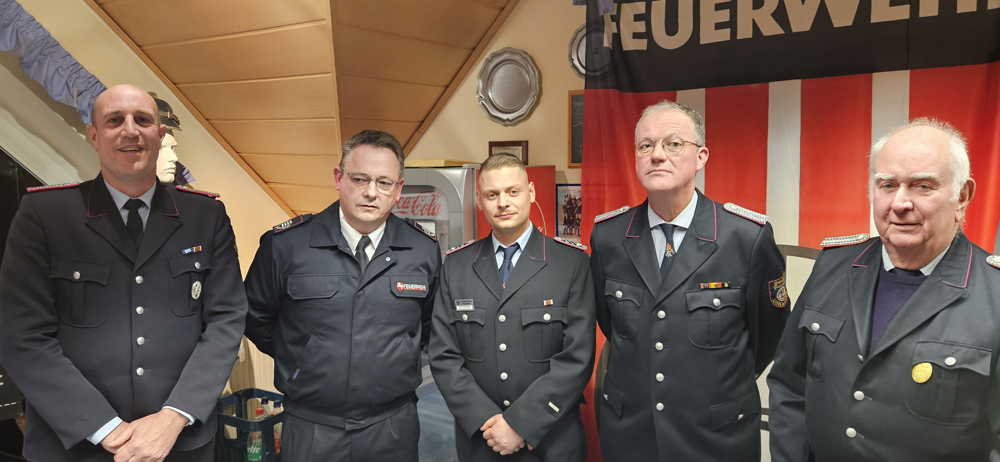
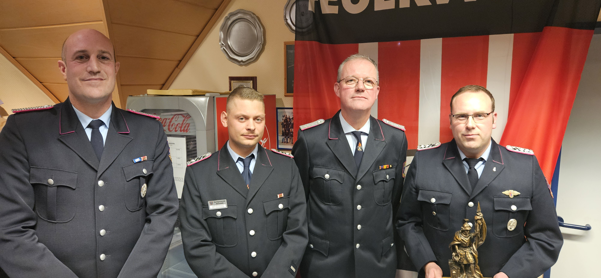


„2025 war alles neu“ – Freiwillige Feuerwehr Liekwegen zieht Bilanz


Bei der Jahreshauptversammlung der Freiwilligen Feuerwehr Liekwegen wird deutlich, dass das vergangene Jahr ganz im Zeichen der Erneuerung stand. Ein modernisierter Fuhrpark, ein erweitertes Führungsteam sowie zahlreiche Beförderungen und Ehrungen prägten das Jahr 2025.

Im April löste das Löschgruppenfahrzeug LF 10 das Vorgängerfahrzeug ab und steigert die Handlungsfähigkeit der Liekweger Brandschützer deutlich: 2000 l Wasser, Platz für neun Einsatzkräfte, vier Pressluftatmer in der Mannschaftskabine und ein pneumatischer Beleuchtungsmast sind nur einige Beispiele für die wesentlich erweiterte technische Ausstattung. Im Juni wurde ein Mannschaftstransportwagen übernommen, der ein zunehmend störanfälliges Vorgängerfahrzeug ersetzt.

Kreisbrandmeister Klaus-Peter Grote bezeichnete die neuen Fahrzeuge als wichtigen Motivationsschub und lobte zudem die vorbildliche Nachwuchsarbeit der Feuerwehr.

Samtgemeindebürgermeister Stefan Kolb dankte den Feuerwehrmitgliedern für ihr Engagement und stellte fest, dass ein zeitgemäßer Brandschutz Geld kostet.

Auch organisatorisch gab es Änderungen. Ortsbrandmeister Björn Held und sein Stellvertreter Justin Zimmermann werden nun von Sebastian Lübke unterstützt. Die neu geschaffene Position des zweiten stellvertretenden Ortsbrandmeisters ist eine Antwort auf das gestiegene Arbeitsvolumen der Wehrführung.

Gemeindebrandmeister Lutz Enning hob hervor, dass von den 35 Einsatzkräften inzwischen 17 als Atemschutzgeräteträger ausgebildet sind, was ein deutlicher Beleg für die Einsatzstärke der Wehr ist.

Im Jahr 2025 rückte die Feuerwehr insgesamt 20-mal aus. Darunter waren neun Brandeinsätze, acht technische Hilfeleistungen und drei Fehlalarme. Besonders in Erinnerung bleiben eine groß angelegte Personensuche mit Vollalarm in der gesamten Samtgemeinde sowie die nächtlichen Einsätze beim August-Unwetter.

Die Freiwillige Feuerwehr Liekwegen zählt derzeit 261 Mitglieder. 35 gehören der Einsatzabteilung an, acht der Altersabteilung, 18 der Jugendfeuerwehr und 19 der Kinderfeuerwehr. Die übrigen Mitglieder unterstützen die Feuerwehr als passive oder fördernde Mitglieder.

Während der Versammlung wurden zahlreiche Beförderungen ausgesprochen. Justin Zimmermann wurde Hauptbrandmeister, Felix Bulmahn, Sean Hartford, Vincent Wolf und Florian Schur sind nun Hauptfeuerwehrmänner. Amelie Much und Philine Bornemann wurden zu Feuerwehrfrauanwärterinnen ernannt; Chris Zschoch und Florian Mensching zu Feuerwehrmannanwärtern. Gemeindebrandmeister Lutz Enning erhielt den Titel Hauptbrandinspektor.

Langjährige Treue zur Feuerwehr wurde ebenfalls gewürdigt. Für 60 Jahre Mitgliedschaft wurden Jürgen Bake und Karl-Heinz Penne geehrt, für 50 Jahre Heinz Büscher. Seit 40 Jahren sind Hans Werner Horn, Rainer Dietze, Alfred Reckmann und Wolfgang Grote Mitglieder der Feuerwehr. Für 25 Jahre erhielten Bernd Pönitzsch, Andrea Olbrich, Olaf Olbrich, Friedrich-Wilhelm Richter, Felix Schwanke und Henning Schur Auszeichnungen. Eine besondere Ehrung ging an Karl-Heinz Korn, dem die Ehrennadel der Feuerwehr-Unfallkasse in Silber für seine langjährige Tätigkeit als Sicherheitsbeauftragter verliehen wurde. Nachträglich wurden außerdem die Niedersächsischen Hochwassermedaillen 2024 an Lutz Enning, Finn Blanke, Thomas Fitzke und Florian Schur überreicht.

Florian Ernst wurde als Feuerwehrmann des Jahres 2025 ausgezeichnet.

Zum Abschluss dankte Ortsbrandmeister Björn Held allen Unterstützern, Helfern und Freunden der Wehr.


  
  
  
  
  
  
  
  
  
  
  
  
  
