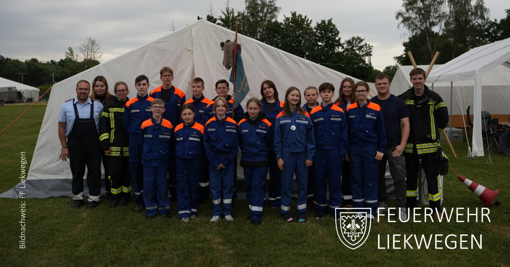
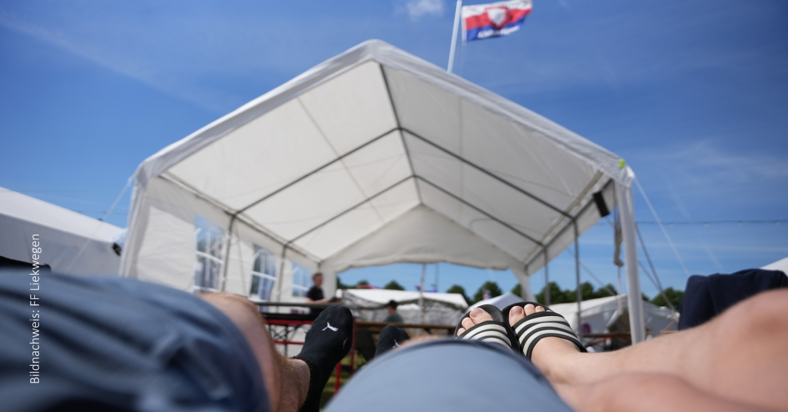
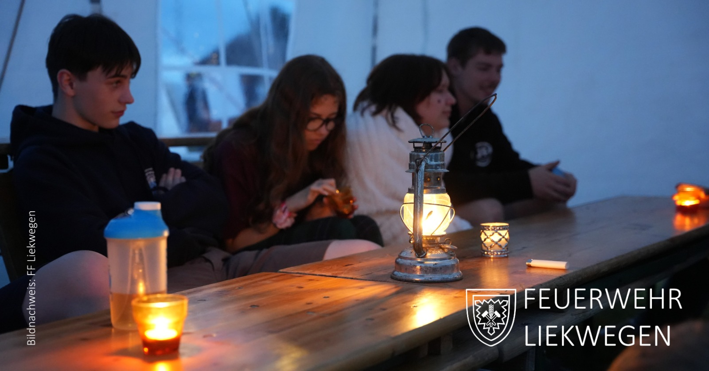
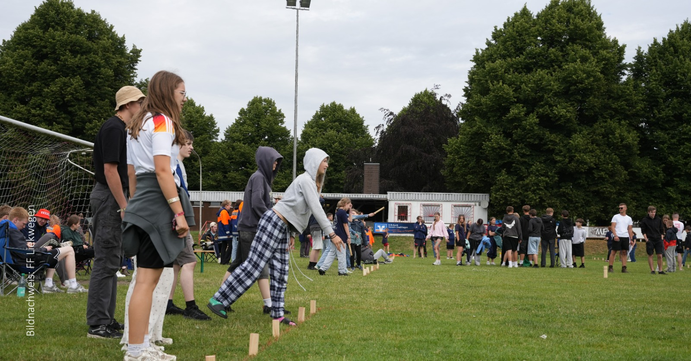
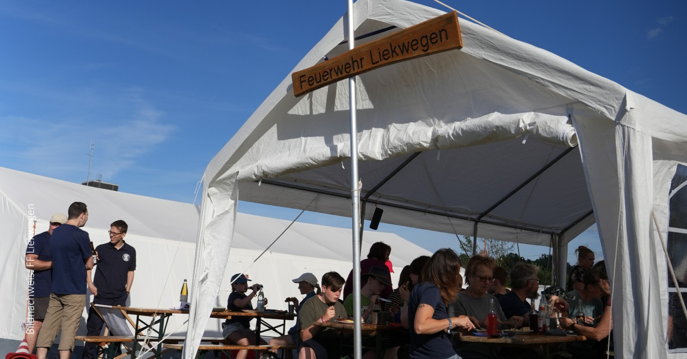

Wie schnell die Zeit vergeht: Bereits vor einer Woche endete das diesjährige Kreiszeltlager der Jugendfeuerwehr, an dem auch die Jugendfeuerwehr Liekwegen teilgenommen hat.

Bei sommerlichem Wetter erwartete die Teilnehmerinnen und Teilnehmer ein abwechslungsreiches Programm mit Angeboten wie Bouldern und Wikinger-Schach sowie zahlreichen weiteren Aktivitäten. Für die Verpflegung war ebenfalls bestens gesorgt, sodass es den Jugendlichen an nichts fehlte.

Einen besonderen Programmpunkt stellte der Besuchsabend dar, an dem Angehörige sowie Mitglieder der Einsatzabteilung die Gelegenheit hatten, das Lagerleben vor Ort kennenzulernen.

Für gute Stimmung war während der gesamten Zeit gesorgt – nicht zuletzt durch das morgendliche Wecklied „Bella Napoli", das mittlerweile für viele Teilnehmende zu einem festen Bestandteil der Zeltlagererinnerungen geworden ist. Wer einen Eindruck davon gewinnen möchte, findet ein entsprechendes Video auf unseren Social-Media-Kanälen.

Die Feuerwehr Liekwegen bedankt sich herzlich beim Orga-Team der Kreisjugendfeuerwehr für die gelungene Organisation sowie bei allen Unterstützerinnen und Unterstützern, die dieses Zeltlager erst möglich gemacht haben.


  
  
  
  
  
